<p align="center"></p>
<h1 align="center">Penny Keeper</h1>
<p align="center"><em>Take care of the pennies...</em></p>

Penny Keeper is a set of plain-English money tools for an Irish household: what you really take home, where
it goes, what you owe, and what you could claim back from Revenue. It runs entirely in your browser from a
single HTML file - no account, no server, nothing uploaded. Open `index.html` and it works, offline, on a
phone or a laptop.

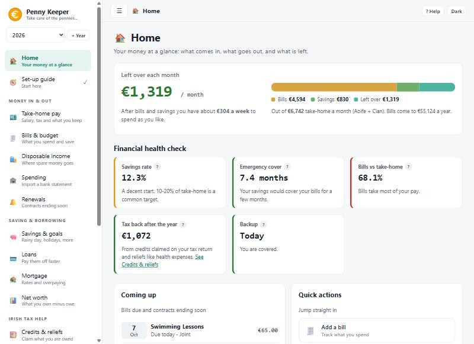

## What it does

**Money in and out**

- **Take-home pay** - enter a salary and see PAYE, PRSI and USC worked out for 2022 to 2027, with the right
  standard rate band and credits for your situation (single, single parent, married, both working), pension,
  AVCs, benefit-in-kind and a bonus. A pay-rise calculator shows how much of an extra euro you keep, and
  *What Budget 2027 means for you* runs your pay through next year's figures.
- **Bills & budget** - bills at any frequency from weekly to annual, shown as weekly, monthly and yearly
  figures. Savings are kept apart from bills. Shared bills can be split three ways: by share of net income, by
  percentages you choose, or so everyone is left with the same spending money each week. A *year ahead* view
  shows which months yearly bills like motor tax and insurance land in. Common Irish bills can be added in a tap.
- **Disposable income** - what is left after bills and savings, and where it goes. Keep a list of subscriptions
  (streaming, a gym, an AI plan), log meals out, takeaways and treats as they happen, and see each month by
  category and per person, with anything shared split the same way as your joint bills.
- **Spending** - import a CSV statement from your bank, teach it your categories with simple rules, and see
  real spending against your budget. Duplicates are skipped when you re-import.
- **Renewals** and **Bill history** - when contracts end so you can switch in time, and what bills really cost
  month by month.

**Saving and borrowing**

- **Savings & goals** - an emergency fund target, goals with a date that become a monthly amount, savings
  accounts with a projection, and money taken out logged against the month it happened.
- **Loans** - daily-interest amortisation, overpayments and lump sums, with the interest saved and what you
  still owe today.
- **Mortgage** - built around Irish conventions: fixed rates rolling onto a follow-on rate, the repayment
  re-solved when the rate changes, overpayments that shorten the term, statements that keep the balance honest.
- **Net worth** - what you own minus what you owe, with savings, loans and the mortgage pulled in
  automatically and snapshots that build a chart over time.

**Irish tax help**

- **Credits & reliefs** - every credit Revenue lists for the year, grouped, with the amounts and a *confirm
  these on revenue.ie* reminder; health expenses; remote working and tuition fee relief; pension relief
  headroom; a year-end checklist. Credits and reliefs that come back after the year ends are shown as an
  estimated refund, kept out of your monthly take-home.

**More tools**

- **Electricity** - upload your smart-meter file and compare day/night/peak and flat tariffs against what you
  actually used.
- **Accounts & payees** - bank accounts and the people and companies you pay, with IBANs masked and checked.
- **Maternity leave** - plan the cash flow of a period of leave: State benefit, employer top-up, what is left.
  On by default; switch it off in Backup & settings if you do not need it.
- **Budget tracker** - plan and track a renovation, a wedding or a build: stages and items with a budget and
  an actual cost, funding sources, a forecast, and how much is left. Files from the standalone [Budget Tracker](https://github.com/shanemc92/budget-tracker)
  import unchanged.

**Backup & settings** - download everything as one file and restore it, export a workbook (`.xlsx`) or CSV,
start a new tax year with your bills carried over, or make a what-if copy of a year.

## Made to be easy to pick up

- A welcome screen, a five-step **Set-up guide** (hide it from the menu once you are done, and bring it back in
  Backup & settings) and a short tour.
- Boxes the maths is waiting on are outlined in **amber**, with a count at the top of the page.
- A **?** tooltip beside most labels, a "How this page works" panel on every page, and a built-in glossary.
- A menu grouped by what you want to do, each item with a one-line description. Fold it away on a big screen.
- Works on a phone (bills turn into cards, a slide-out menu), in light and dark, with keyboard focus
  throughout, and prints cleanly.

| | |
|---|---|
| 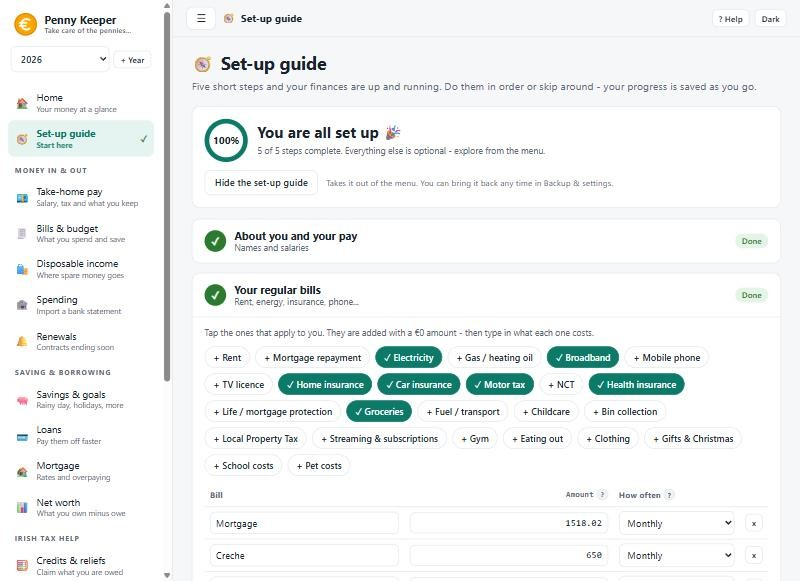 | 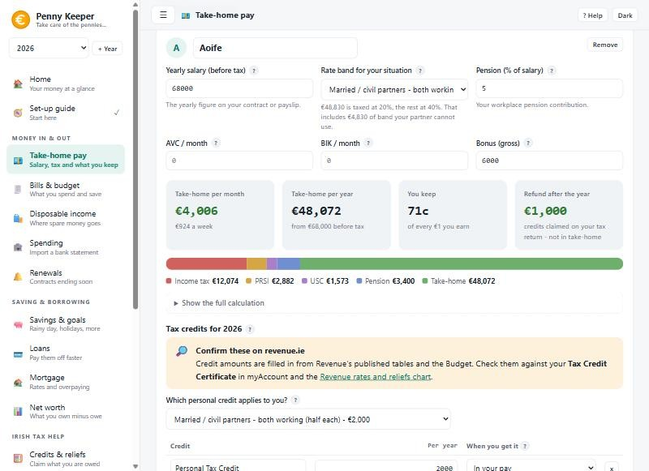 |
| The set-up guide | Take-home pay |
| 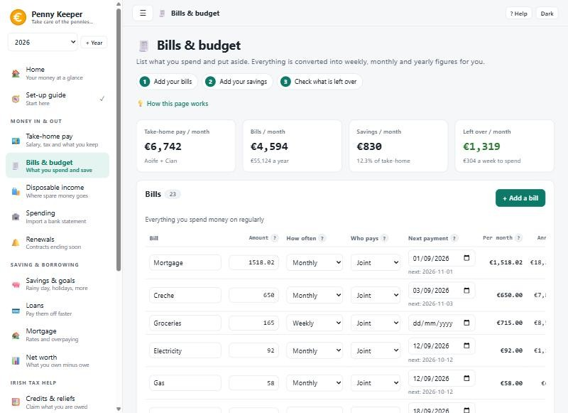 | 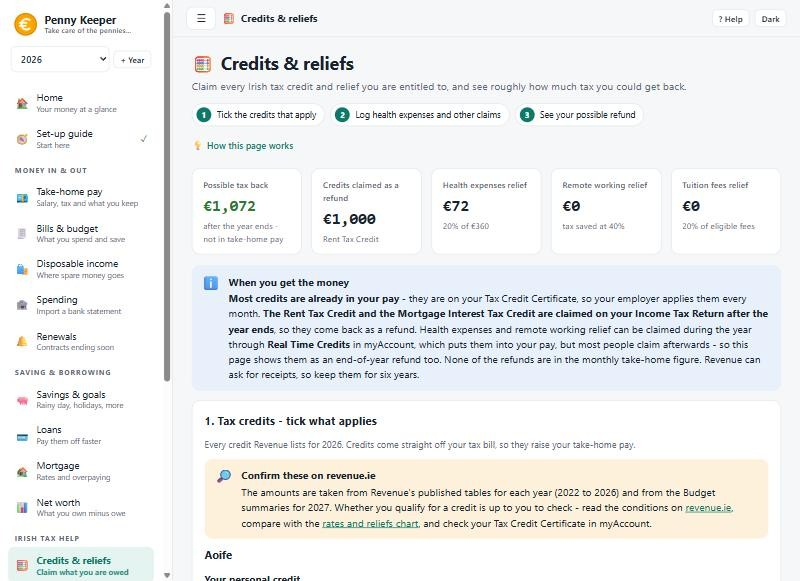 |
| Bills & budget | Credits & reliefs |
| 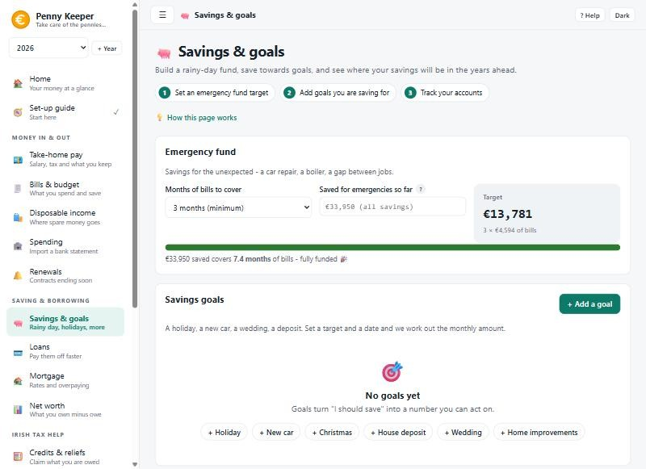 | 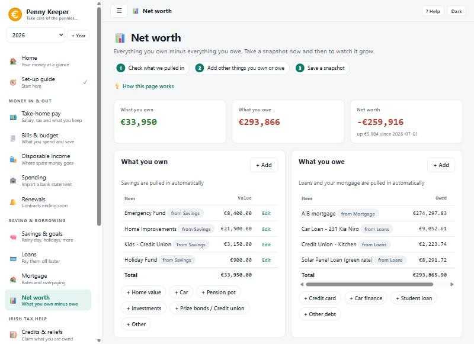 |
| Savings & goals | Net worth |
| 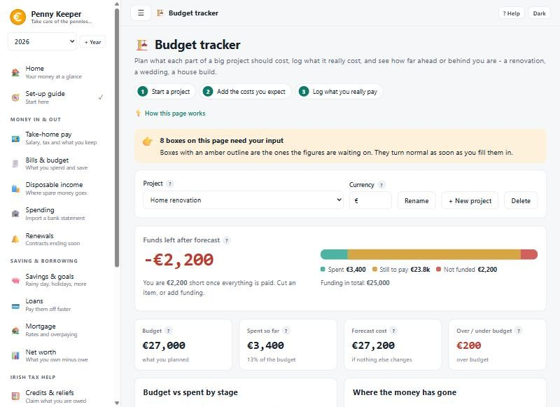 | 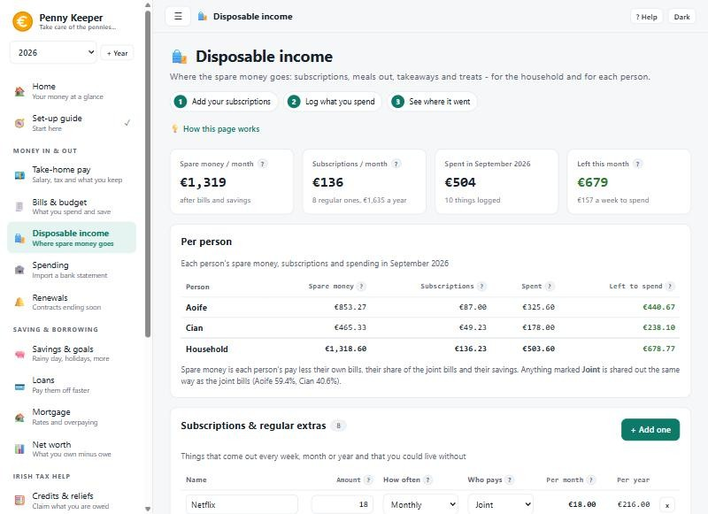 |
| Budget tracker | Disposable income |

<p align="center">
  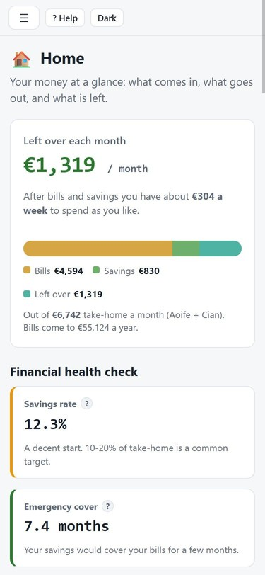
  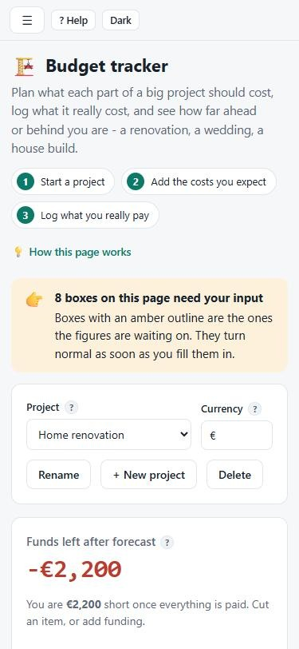
  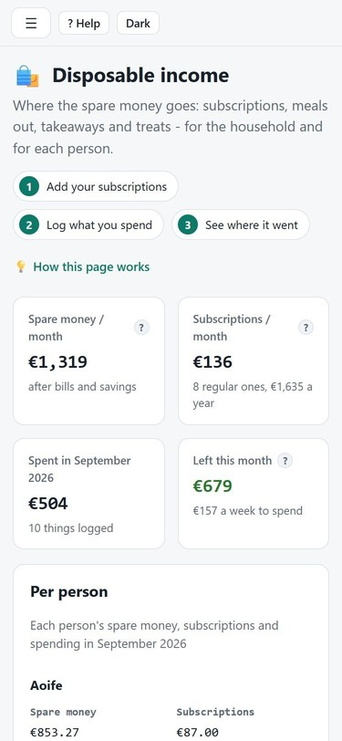
</p>

## Running it

Any of these work, they all run the same file:

1. **Open it locally** - open `index.html` in a browser. It works offline.
2. **Host it** - drop `index.html` on GitHub Pages, Netlify, or any static host. On a phone, use
   *Add to Home Screen* and it behaves like an app.
3. **Self-host with sync between devices** - [`homelab/`](homelab/) is a small server that keeps the data in a
   JSON file you own. It serves this same `index.html`; see [homelab/README.md](homelab/README.md).

## Try it with example data

On the welcome screen choose **Show me an example household**, or go to **Backup & settings** and load
the example. It is a fictional two-income household with bills, loans, a mortgage, savings, a year of
bank transactions, electricity usage and bill history. `demo/example-household-2026.json` is the same file.

## Your data

Everything is held in your browser's `localStorage`. It is never transmitted, and there is no analytics,
telemetry, or fonts or scripts loaded from anywhere. The one request the page makes is to its own address,
once, to check whether a [self-hosted server](homelab/) wants to sync; it carries none of your data.

Clearing site data wipes it, so **download a backup now and then**. The Home page and the menu remind you
if it has been more than 30 days. You can also export a workbook (`.xlsx`) with a sheet per section, or any
section as CSV.

"+ Year" rolls bills, loans, the mortgage, savings, rules, people, goals, contracts, accounts, payees and the
maternity plan into a new year, applies that year's tax figures and credits, and starts transactions and meter
usage empty. **Make a what-if copy** duplicates a year so you can try changes side by side.

## Tax figures

Built in for 2022 to 2027:

- **2022 to 2026** - rate bands, USC bands and every credit are from Revenue's
  [tax rates, bands and reliefs chart](https://www.revenue.ie/en/personal-tax-credits-reliefs-and-exemptions/tax-relief-charts/index.aspx)
  and its [USC page](https://www.revenue.ie/en/jobs-and-pensions/usc/standard-rates-thresholds.aspx).
- **2027** - from the published Budget 2027 summaries: standard rate band 46,500 single (55,500 married
  one income, 50,500 single parent), USC 2% band to 30,300, PRSI 4.35% rising to 4.5% in October,
  credits 2,125 personal, 2,125 employee and earned income, 1,150 rent (2,300 couple), 2,050 home carer.
  Credits those summaries do not state carry the 2026 amount (the married credit is double the single one)
  and are marked **confirm** wherever they appear.

Credits listed: personal (single, married, widowed in each of its forms), employee, earned income, home
carer, single person child carer, widowed parent (years 1 to 5), incapacitated child, dependent relative,
rent (single and couple), mortgage interest, age (single and married) and blind (single, one spouse, both).

### When you get a credit

- **In your pay** - most credits are on your Tax Credit Certificate, so your employer applies them every
  month. They are in the take-home figure.
- **As a refund after the year** - Revenue says the **Rent Tax Credit** is claimed on your Income Tax Return
  once the year has ended, and the **Mortgage Interest Tax Credit** is a similar year-end claim. These are
  *not* in the monthly figure. They are shown as an estimated refund, capped at the tax you actually paid.
  Each credit row has a *When you get it* setting, in case yours is paid differently.
- **Reliefs** - health expenses, remote working and tuition fees are shown as year-end refunds too.
  Revenue's *Real Time Credits* (myAccount) lets health, nursing home and remote working expenses be
  claimed during the year, which puts them into your pay, but that needs a claim each time, so the app treats
  them as a refund.

The Mortgage Interest Tax Credit is up to 1,250 for 2023 to 2025 and up to 625 for 2026 according to
Revenue's credit page (its rates chart lists 1,250 for 2026), and is not legislated beyond 2026.

**Always confirm on [revenue.ie](https://www.revenue.ie) and on your own Tax Credit Certificate.** The app
reminds you on every page that lists credits. Every figure is editable, and **Reset to Revenue figures**
restores the built-in numbers.

This is an estimate for planning, not a payslip and not tax advice. It does not model week-1 basis, the
PRSI credit for low earners, or reduced USC rates for medical card holders and over-70s. The Credits &
reliefs calculators (remote working, tuition, pension headroom) are simplified.

### Calculation notes

- **Two-income couples.** Mark both people "married, both working". Each has their own standard rate
  band; whatever one cannot use (their income is below it) passes to the other, up to the extra a
  one-income couple would get (53,000 against 44,000 in 2026). The household total never exceeds
  Revenue's combined limit (88,000 in 2026).
- **Married, one income** gets the couple's full personal credit (4,000 in 2026); two earners get half each.
- **PRSI** is not charged at or below the weekly threshold (352).
- **A bonus** is taxed as the extra tax on top of normal pay, so one that straddles the 20%/40% line is split
  correctly.

## Development

`index.html` is **generated**. The page is written as small files in `src/` and joined by a short build
script, and the result is still one self-contained file with no external scripts or styles, so it opens from
a disk, GitHub Pages or the Docker image alike.

```
src/head.html, style.css, body.html    the head (meta, CSP), stylesheet and page skeleton
src/logo.svg, icon-64.png, icon-180.png the logo (sidebar and favicon) and its PNG fallbacks
src/engine/*.js                        calculations, data model, storage - no page code
src/ui/*.js                            the shell, every page, and start-up
demo/example-household-2026.json       the example household (embedded as DEMO_YEAR_JSON)
tests/                                 maths tests, page checks, colour-contrast check
build.py                               joins it all into index.html
tools/make-icons.py                    redraws the PNG icons from the logo (only when it changes; needs Pillow)
```

```bash
python build.py             # write index.html and tests/run.html
python build.py --check     # fail if index.html is not what src/ produces
node tests/run.js           # the maths tests, no browser needed
node tests/page.js          # the built page compiles, has no duplicate functions, is self-contained
python tests/contrast.py    # text/background colours meet WCAG AA in both themes
```

Everything uses only the standard library of Python and Node. You can also open `tests/run.html` in a browser
to run the maths tests there. The files in `src/engine` and `src/ui` share one scope and are joined in
file-name order, so the number prefixes are the order they run in. Keep page code out of `src/engine`: the
engine has to load with no page at all, which is what lets the tests run without one.

### Automation

`.github/workflows/build.yml` runs on every push to `main` (and on pull requests): it builds the page, runs the
tests and checks, and on `main` **commits the rebuilt `index.html` back** if the sources changed it, so you
only ever edit `src/`. `docker-publish.yml` then publishes the image once that build succeeds, and
`checks.yml` calls the shared static checks (secret scan, no off-origin assets, a CSP).

If `main` is protected against direct pushes, let `github-actions[bot]` bypass the rule, or run
`python build.py` before committing and let the workflow only verify it.

### Updating for a new tax year (after each Budget)

1. In `src/engine/10-tax-data.js` add the year to `TAX_PRESETS` (rate bands, USC bands, PRSI) and a column to
   `CREDIT_TABLE` and `CREDIT_YEARS`. Mark anything the Budget summaries do not state in `CREDIT_EST_2027` (rename
   it for the new year), so it shows as *confirm*.
2. Add the year's figures to the Revenue tests in `tests/maths.test.js`, copying them from revenue.ie.
3. `python build.py`, `node tests/run.js`, and push. The workflow does the rest.

### Notes on the build

- Charts are drawn on canvas; the `.xlsx` export is a minimal store-only ZIP, so there is no library to keep
  current.
- The guidance layer - page headers, tooltips, the amber highlighting, glossary, welcome and tour - sits on top
  and never touches your data.
- Editing a box and pressing Tab keeps your place: the page rebuilds after the field is committed and puts
  focus back, so you can fill a form with the keyboard.
- Light and dark themes (follows your device on first visit), keyboard focus states, works down to a 320px
  screen, and has a print stylesheet.

## Maternity leave notes

Irish figures, all editable: 26 weeks paid leave plus up to 16 weeks additional unpaid, and
Maternity Benefit at 299 a week for 2026 (Budget 2026 added 10 to the 2025 rate).

Maternity Benefit is taxable but exempt from PRSI and USC - Revenue collects the tax by trimming
your credits and rate band, which normally works out at 20% while income is down. That is the
default and it is editable.

Employer pay periods run in sequence from the start of the leave, each with its own policy: full
pay topping up the benefit, a percentage of salary, or a flat monthly amount. Anything declared
past the end of the leave is ignored.

Employer pay is costed at the marginal rates for the **leave year** rather than a normal year,
because a long leave often drops someone out of the higher band entirely. A refund frequently
turns up after year end once a full year of credits has been spread across reduced income; this
does not try to predict that, so treat the shortfall as the cautious figure.

Pausing savings closes the monthly cash gap but does not change where the household ends up - the
money either goes into a savings account or stays in the current account to pay the bills. It
matters when the savings sit somewhere you would rather not touch.

## Mortgage notes

Irish conventions, and where they stop:

- **How the interest is worked out is a setting, because lenders genuinely differ.** Two options:
  *daily, 1/365th* accrues on the cleared balance every day and splits a period that straddles a
  rate change at the change date, which is what most lenders describe; *monthly, 1/12th* charges a
  flat twelfth of the annual rate at each payment and counts no days at all, which is what a good
  number of them actually do. On a 370k balance the two are about 20 a year apart. The stub between
  drawdown and the first payment is charged daily either way, which is universal.
- If every statement's interest comes out **the same amount off in the same direction**, that is
  the wrong setting rather than an error - switch it and watch the column. Tested against a real
  EBS mortgage, daily left roughly 22 a year unexplained and monthly tied out to the cent on all
  four annual statements.
- The repayment is solved with the monthly rate that matches the setting, so a schedule left alone
  lands on zero at the end of the term. Because a repayment is a whole number of cents it never
  divides a balance exactly, so the final payment takes up the few euro left over.
- **Statements are readings, not payments.** The monthly payments are always modelled; what a
  statement does is pin the balance. Everything modelled since the statement before it is adjusted
  onto the figure the lender printed, and the adjustment is shown so you can see how much drift it
  took out. One statement a year - which is all most lenders send - is enough to keep years of
  modelling honest, and an annual statement is *not* treated as a payment, which would otherwise
  count the year twice over. The interest and amount off the statement are optional and purely to
  check the model against: a few euro a year apart is day-count convention, hundreds means a wrong
  rate or date.
- When the rate changes the repayment is recalculated over the payments remaining out of the
  **original** term - the term does not stretch. Overpaying does the opposite: the repayment stays
  put and the term shortens, which is the Irish default unless you ask to re-amortise.
- Picking up mid-mortgage, put the repayment from your statement in the "repayment now" box. After
  a few overpayments the lender is still collecting the contractual amount, not one re-solved off
  the lower balance, and only your statement knows what that is. Leave it at 0 and it is worked out
  from the rate and the term.
- Fixed rates cap what you can overpay in a year before a break funding fee applies - commonly 10%,
  but it varies and it is in your loan offer, so the allowance is editable and going over only ever
  warns. **The fee itself is not estimated**: it depends on funding rates on the day, and guessing
  it would be worse than leaving it to you to ask.
- Insurance collected with the repayment - mortgage protection, home cover, whatever your lender
  bundles into the direct debit - goes in as one figure. It makes the amount leaving the account
  right without ever touching the balance, because it is not interest and not capital.
- Nothing on this page feeds the Bills & budget page. Add the repayment there as a bill if you want it in the
  household budget.

Mortgages are deliberately left out of the Home page's "loans still to pay" figure and given their
own, because a 300k mortgage swamps a car loan and makes that number useless for the thing it is
there for.

## Electricity notes

Get your HDF file from the ESB Networks customer portal - it is the half-hourly export for your
MPRN, in the format `MPRN, Meter Serial Number, Read Value, Read Type, Read Date and End Time`.

- Rate windows default to the common Irish ones (night 23:00-08:00, peak 17:00-19:00, day for
  everything else) and are editable, including windows that wrap past midnight.
- Readings are the **end** of each interval, so the row stamped 08:00 covers 07:30-08:00 and counts
  as night. Getting that backwards shifts half an hour of cheap units into the day band every day.
- kW and kWh read types are both handled, and the interval length is derived from the data rather
  than assumed.
- If you have less than twelve months, the figures are scaled to a full year.
- Only the summary is saved: monthly totals per band plus a 48-slot average day, about 1.4 KB from
  a 2 MB file.

The average-day chart colours each half hour by its rate band and shades the night and peak
windows, which makes it obvious whether a day/night/peak plan is worth switching to or whether a
flat 24-hour rate suits you better.

## Licence

MIT - see [LICENSE](LICENSE).
